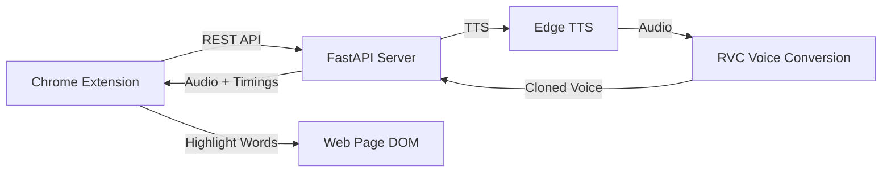

# Anime Voice Reader

Browser extension that reads selected text aloud using AI-cloned anime character voices with real-time word highlighting.

## Architecture



## Stack

| Component | Technology                                        |
| --------- | ------------------------------------------------- |
| Extension | Chrome Manifest V3, Vanilla JS                    |
| Backend   | Python, FastAPI, Uvicorn                          |
| TTS       | Edge TTS → RVC (Retrieval-based Voice Conversion) |
| Timings   | Word boundaries from TTS / Whisper fallback       |

## Quick Start

### Backend

```bash
cd backend
pip install -r requirements.txt
python server.py
```

Add `.pth` voice models to `backend/models/`

### Extension

1. Open `chrome://extensions`
2. Enable Developer Mode
3. Load unpacked → select `extension/` folder
